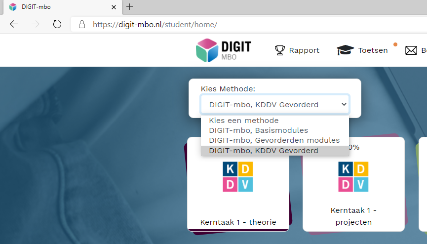
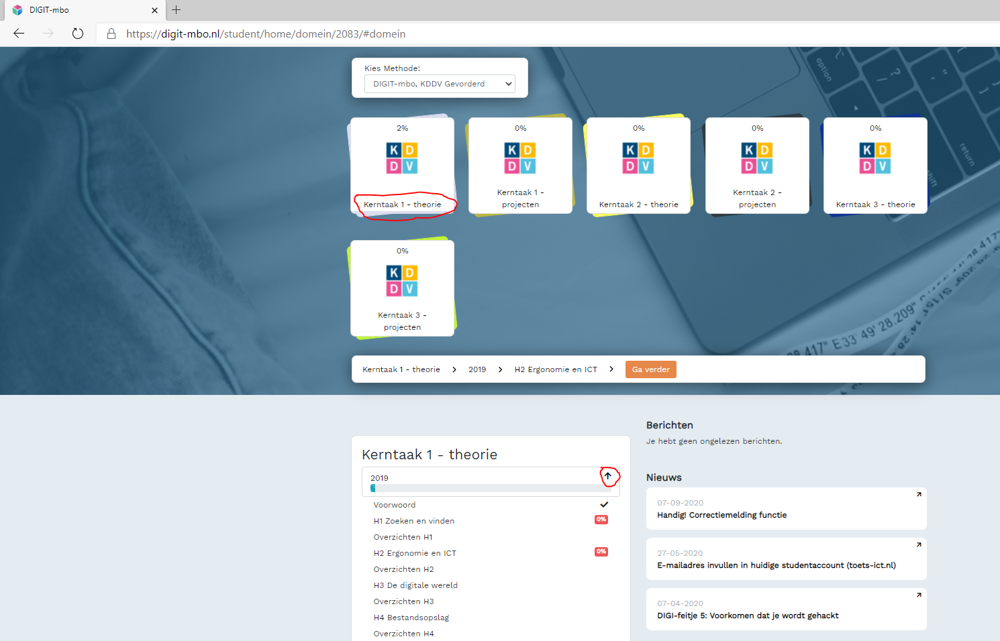

# kd-digitale-vaardigheden-1 - Starten - Taak02 -  de modules

## Uitleg
> Om te kunnen oefenen voor het examen zijn er verschillende modules beschikbaar in Digit-MBO.  
> **Je moet zelf testen welke modules je nodig hebt om het examen te halen.**  
> Sommige dingen weet je misschien al en sommige dingen niet.

1. Het examen zijn vragen over alle modules
2. Sommige dingen weet je al en sommige niet

## Opdrachten
1. Open de link: [https://digit-mbo.nl/student/tests/](https://digit-mbo.nl/student/tests/)
2. Kies de methode digit-MBO KDDV Gevorderd  

  

3. Klik op kerntaak 1 en klik onderin het scherm op het pijltje naast 2019  

4. Bekijk de verschillende modules en opdrachten in kerntaak 1 door op de hoofdstukken te klikken  

## Leerdoelden
1. Je maakt kennis met de digit-MBO leeromgeving

## Eindresultaat
Goede (zelfstandige) voorbereiding voor het examen Digitale Vaardigheden.

### Bronnen
[Digit-MBO](https://digit-mbo.nl/).