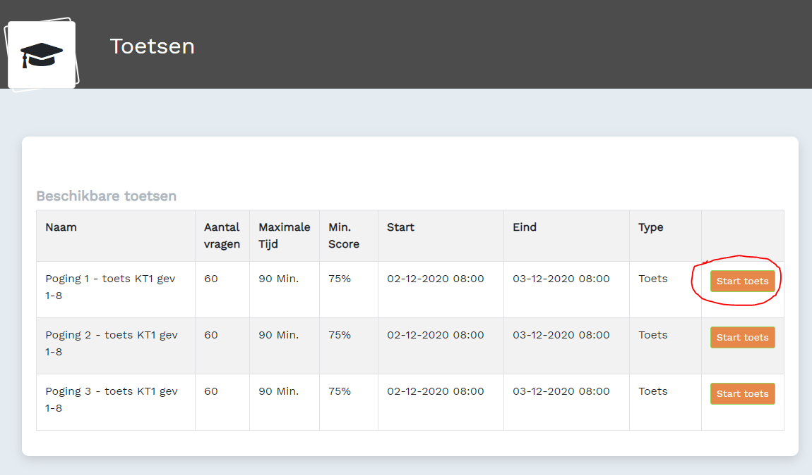

# kd-digitale-vaardigheden-1 - OEFENEN - Taak01 - oefentoets KT1

## Uitleg
> **Je moet zelf testen welke hoofdstukken je moet oefenen om het examen te halen.** 

Door middel van oefentoetsen kun je zien van welke hoofdstukken van Kerntaak 1 je nog moet oefenen. 

## Opdrachten
1. Log in op: [Digit-MBO](https://entree.instruct.nl/?elo=digit-mbo).
1. Ga naar het tabblad [Toetsen](https://digit-mbo.nl/student/tests/). 
2. Maak de eerste oefentoets Poging 1 - KT1: 

4. Je moet de toets in een keer maken. Let op! sluit je de pagina af dan moet je opnieuw beginnen.

## Leerdoelden
1. Je maakt de eerste oefentoets van Kerntaak 1.

## Eindresultaat
Het maken van je eerste oefentoets.

### Bronnen
[Digit-MBO](https://entree.instruct.nl/?elo=digit-mbo).